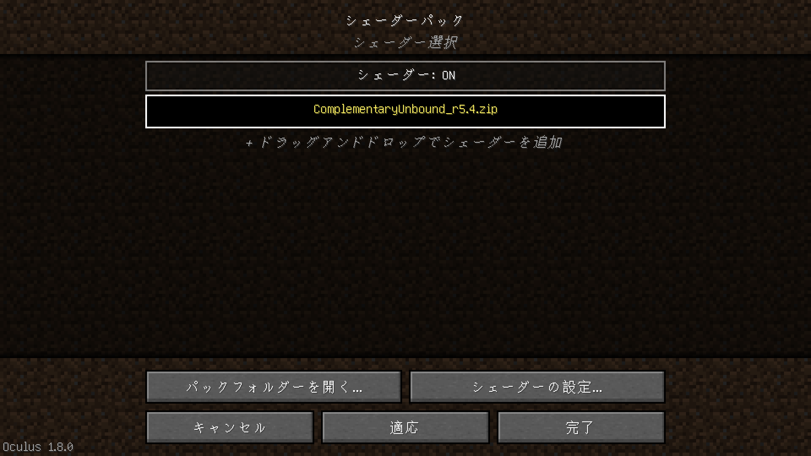

# ゆた鯖ModサーバーのPrism Launcherのインスタンス

## Prism Launcherの導入

[ここ](https://prismlauncher.org)からインストーラーを落としてインストールする

## 起動構成のインポート

1. [Releases](https://github.com/KiRura/ytmods-prism-instance/releases/latest)から`yutasaba-instance.mrpack`を落とす
2. Prism Launcherにドラッグアンドドロップ\

3. OK\

### 起動構成の詳細

この起動構成はOptifineのほとんどの機能の再現や、様々な処理の改善をするModが集められている[Drill](https://modrinth.com/modpack/drill)を基に作られました。詳細はDrillのREADMEをお読み下さい。  

### NVIDIA GeForceをお使いの方へ

[acedium](https://github.com/ferriarnus/acedium)の導入をおすすめします。

## 設定

1. 編集\

2. 設定\

3. 「メモリ」にチェックを入れる
4. 「最大メモリ割り当て」を`8192 MiB`にする\

5. **もし**「`8192 MiB`」の隣にバツマークが付いた時は`6144 MiB`にする

## 起動

1. 編集画面の右下の「起動」or\
起動構成一覧のアイコンをダブルクリック or\
起動構成一覧の右側の「起動」から起動できる\
\

## 推奨 - Minecraft内の設定

### 各種リソースパックを適用する

リソースパック自体は元から入っていて、まだ適用されていない段階\
順不同\

- SodiumTranslations.zip
  - 画質設定周りの日本語をある程度充実させる
- Optional GoG4 sound pack
  - [Grimoire of Gaia 4](https://www.curseforge.com/projects/228948)のモブの声を追加する
  - 家族がいる所でスピーカーでやると気まずい雰囲気になる
- Default Connected Textures
  - ガラスや本棚などの同じブロック同士の境目を無くす
- Glass Pane Culling Fix
  - 板ガラスの変な横線を無くす

## 参加

サーバーアドレスは[ゆた鯖内](https://discord.com/channels/610020293208965151/742789380569301023/1343827340123312208)を参照

## 任意 - forgeとmod達の更新確認

しなくても特段問題は無いが、気になる人はやる

### forge

1. 編集画面の「バージョン」で「Forge」を選択状態にし、「バージョンを変更」\

2. 一番上のバージョンを選択状態にする
3. OK\

### mod達

1. 編集画面の「mod」で適当なmodを選択状態にしてから`Ctrl + A`で全てを選択状態にする
2. 「更新を確認」\

3. OK\

## FAQ

### yuushyaがサーバー側と同じ2.2.2なのに接続できない

\
現状、発生タイミングがランダムであるため原因は一切不明であり、まっさらなforge入りの起動構成を作り直して.connectorフォルダを除くmod達をそのまま全て移動するだけで解決することだけ分かっています。

### 新しくmodを入れたい

1. 編集画面の「mod」で「Modのダウンロード」\

2. 「CurseForge」を選択して入れたいmodの名前を入れる
    - **もし**中々見つからないようであれば、「Modrinth」を選択する\

    - それでも見つからなければ「フィルター設定」から「Modローダー」の「Fabric」にチェックを入れ、再度CurseForge -> Modrinthと探す\

3. 入れたいmodの名前をダブルクリックする\

4. 一通り選び終わったら「確認」
5. OK\

### シェーダーを動かしたい

1. 編集画面の「シェーダーパック」で「シェーダーをダウンロード」
2. 検索
3. ダブルクリック
4. 確認
5. OK\

6. Minecraft内で「ビデオ設定」の「シェーダーパック」の画面でシェーダーを適用させる
\

### サーバー側とmodのバージョンが合わないっぽい

1. 編集画面の「Mod」で対象のmodを選択状態にし、「バージョンを変更」\

2. Minecraftの画面に出てきたサーバー側のバージョンを選ぶ\

3. 「再インストール」
4. [任意 - forgeとmod達の更新確認 / mod達](#mod達)の作業をする際、バージョンを維持する必要があるmodはこの画面で対象のmod名の左にあるチェックを外す\

